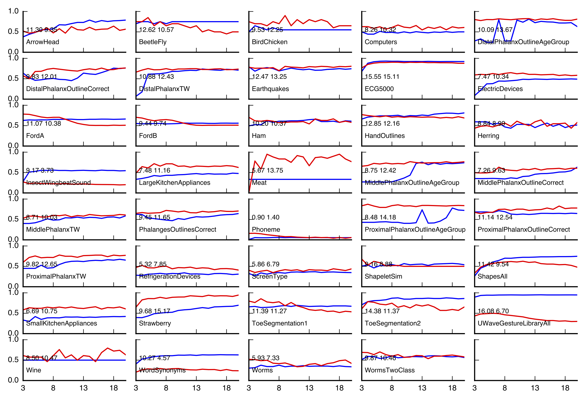
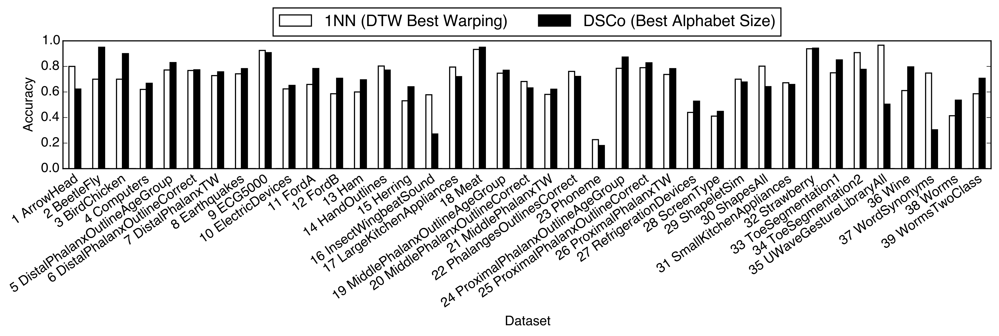

# DSCo: Domain Series Corpus

DSCo is a language modeling based approach towards time series classification.
This repository is to support our paper titled "DSCo: A Language Modeling Approach for Time Series Classification", which was accepted at MLDM 2016. Please find the author preprint here: [http://orbilu.uni.lu/handle/10993/26733](http://orbilu.uni.lu/handle/10993/26733)

## How DSCo works

* Convert real-valued time series into texts using SAX (both training and testing data)
* Build per-class corpus from texts (model building)
* Calculate fitness scores (using the text segmentation techniques)
* Assign classification labels based on segmentation fitness scores

## Performance comparison between SAX-distance based 1NN and DSCo

As shown, DSCo (red lines) performs better in the majority of datasets from UCR.
Numbers in the plots indicate AUC for SAX and DSCo respectively (bigger AUC indicate higher overall accuracy).

## Performance comparison between DTW-distance based 1NN and DSCo (best results for both)

