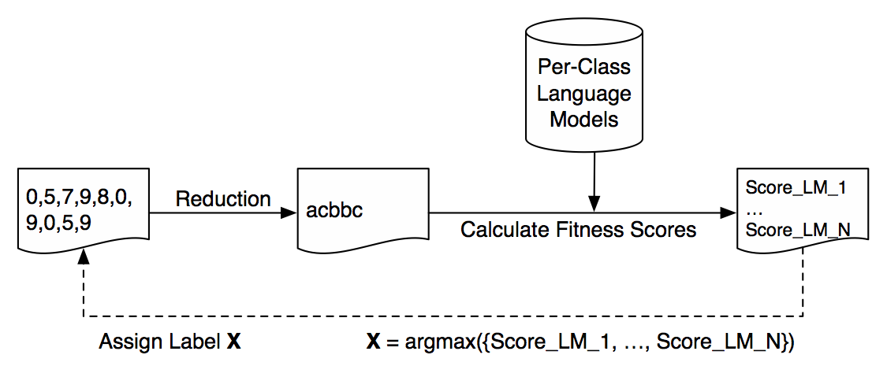

# DSCo-NG: Next Generation Domain Series Corpus

DSCo-NG is a language modeling based approach towards time series classification. It improves its predecessor in terms of both efficiency and accuracy.

This repository is to support our paper titled "DSCo-NG: A Practical Language Modeling Approach for Time Series Classification", which was submitted to IDA 2016.

## Previous version of DSCo
DSCo v1.0 code is available at [https://github.com/serval-snt-uni-lu/dsco/tree/v1.0](https://github.com/serval-snt-uni-lu/dsco/tree/v1.0)

Our paper introducing DSCo is titled "DSCo: A Language Modeling Approach for Time Series Classification", which was accepted at MLDM 2016. Please find the author preprint here: [http://orbilu.uni.lu/handle/10993/26733](http://orbilu.uni.lu/handle/10993/26733)

## How DSCo-NG works




* Convert real-valued time series into texts using SAX (both training and testing data)
* Build per-class corpus from texts (model building)
* Calculate fitness scores (using the text segmentation techniques)
* Assign classification labels based on segmentation fitness scores

## Code tutorial

This repository comes with a sample dataset and a test script. Simply run the following command to see the results.

```bash
$ python test.py
```

test.py first converts all datasets from .mat to .csv and then symbolizes instances into text strings. Then it counts the unigram and bigram frequencies to build language models for each class. Finally, it breaks symbolized strings into segments of the same length and calculates the bigram probability in order to assign the class label.

```python
from prepare_datasets import get_folders
from prepare_datasets import saxify_all
from build_corpus import build_all_corpora
from dsco_classification import process_results
from os.path import join
import pandas as pd


if __name__ == '__main__':

    print 'Converting .mat to .csv and Symbolizing real-valued data to strings'
    saxify_all('NewlyAddedDatasets')
    print 'Done converting datasets'
    print '-' * 80

    print 'Extracting unigrams and bigrams'
    build_all_corpora('NewlyAddedDatasets')
    print 'Done extracting unigrams and bigrams'
    print '-' * 80

    for folder in get_folders('NewlyAddedDatasets/'):
        print 'Processing %s' % folder
        results = process_results(folder, resultsdir='results')
        df = pd.DataFrame(results, columns=['WL', 'A', 'Acc'])
        retf = join(folder, 'results.csv')
        df.to_csv(retf, index=False)
        print '-' * 80
        print "DSCo-NG's suggestion:"
        i = df['Acc'].argmax()
        print 'w: %d\ta: %d\taccuracy: %f' % (df.iloc[i, 0], df.iloc[i, 1], df.iloc[i, 2])
        print 'Results are saved to %s' % retf
        print '-' * 80
```


## Performance comparison between DTW-distance based 1NN, DSCo and DSCo-NG


